## App JS Conf 2023


### Wednesday

#### Workshop - Expo Modules

(Material)[https://hackmd.io/@EFXGBcSCR0-VcFBNI6D-ng/BkWnHLhW3]

Really well documented, communicated and with great exercises.
It's now unbelievably easy to integrate Native code into RN with the help of the new architecture.

```ts
import { FirstModule } from 'workshops-charts';
<View style={styles.button}>
        <Button
          title="Run async function"
          onPress={async () => {
            const module = requireNativeModule('FirstModule');
            const result = await module.functionAsync();
            Alert.alert('NativeModule', JSON.stringify(result));
          }}
        />
      </View>

      <View style={styles.button}>
        <Button
          title="Run sync function"
          onPress={() => {
            const module = FirstModule;
            const result = module.function();
            Alert.alert('NativeModule', JSON.stringify(result));
          }}
        />
      </View>
```

```ts
import { requireNativeModule } from 'expo-modules-core';

type FirstModuleType = {
  readonly functionAsync: () => Promise<string>;
  readonly function: () => string;
};

const module = requireNativeModule<FirstModuleType>('FirstModule');

export default module;
```

```swift
import ExpoModulesCore

public class FirstModule : Module {
  public func definition() -> ModuleDefinition {
    Name("FirstModule")

    AsyncFunction("functionAsync") {
      return "Hi from Async"
    }

    Function("function") {
      return "Hi there!"
    }
  }
}
```

### The beer garden


[Eszeweria](https://www.google.com/maps/place/Eszeweria/@50.0506342,19.9445393,3a,75y,90t/data=!3m8!1e2!3m6!1sAF1QipM1A1aGMkP777Ueb06wiToingpHWz3pIEnKFwk!2e10!3e12!6shttps:%2F%2Flh5.googleusercontent.com%2Fp%2FAF1QipM1A1aGMkP777Ueb06wiToingpHWz3pIEnKFwk%3Dw114-h86-k-no!7i4032!8i3024!4m17!1m9!3m8!1s0x47165b6a2e7d8bef:0x62672e9c1bce5ed7!2sKazimierz,+Kraków,+Polen!3b1!8m2!3d50.0485563!4d19.9447183!10e5!16zL20vMDJ2cHk4!3m6!1s0x47165b7d5b894933:0xfff2cca5d376a5e6!8m2!3d50.0505691!4d19.9445711!10e5!16s%2Fg%2F11gmt9t0bn?entry=ttu)

### Thurday - talks

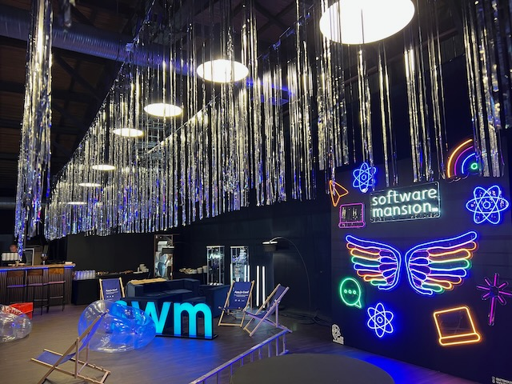


## Keynote

- **_Charlie Cheever & James Ide
  Keynote - community and workflows_**


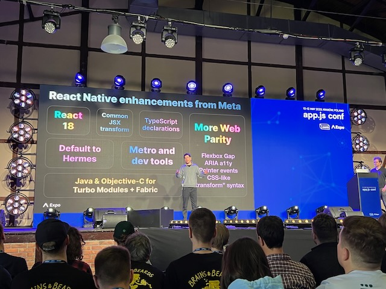

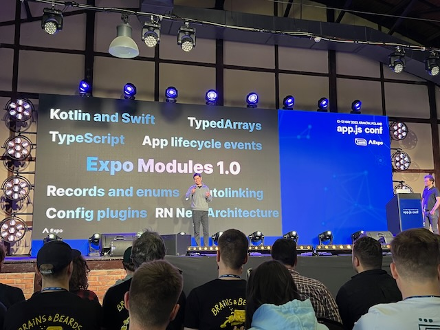

Blue Sky the new twitter

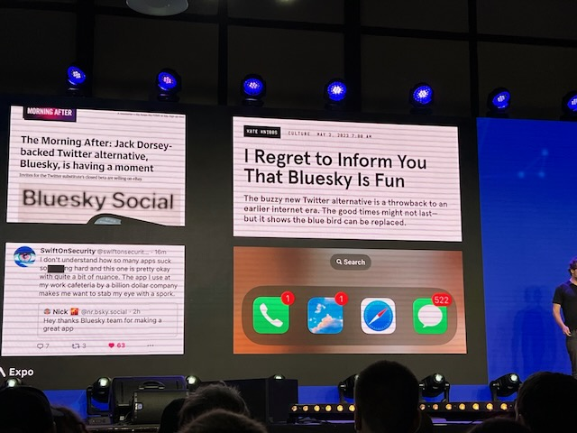


- Jon Samp
  Expo Application Services: Iterate with confidence


- **_William Candillon
  The joy of painting with Skia_**

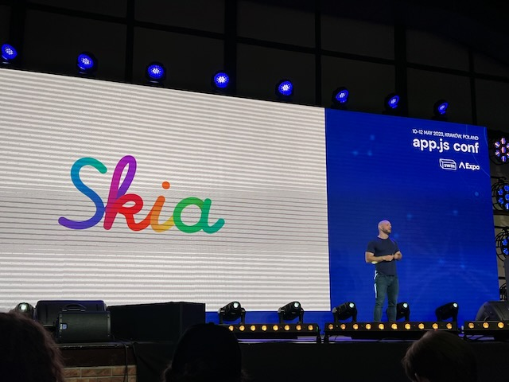


- **_Johannes Schickling
  Local-first state management with Riffle & SKDB_**


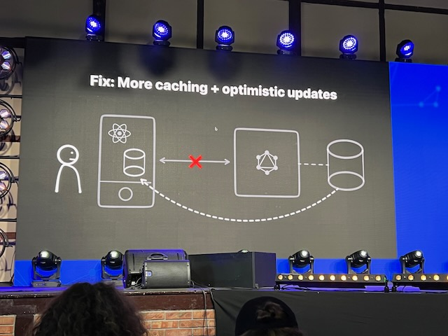

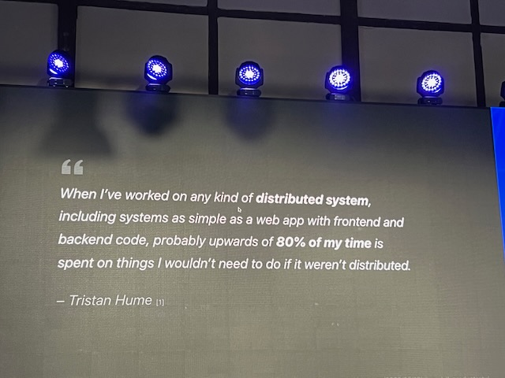

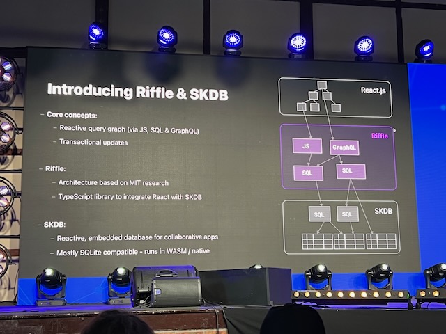

Realm mongo db

- **_Kadi Kraman
  Building 5 star app_**


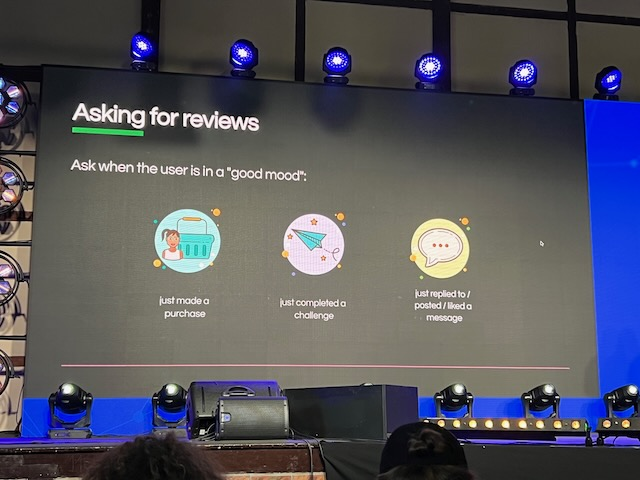


- **_Evan Bacon
  Write once, route everywhere: File system-based navigation for native apps_**


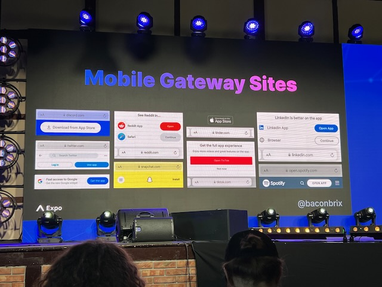


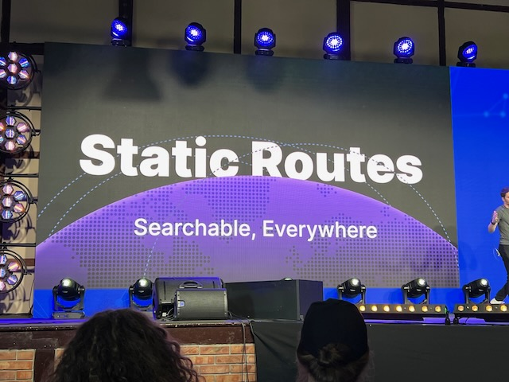


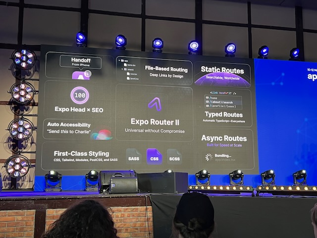

- Monica Restrepo
  How does Shopify change and adapt to the new architecture changes in React Native?


- Krzysztof Piaskowy
  3D and Canvas-Based Animations with Reanimated

- Kudo Chien
  React Native on Linux with the new architecture

- **_Saad Najmi
  Taking React Native to macOS_**


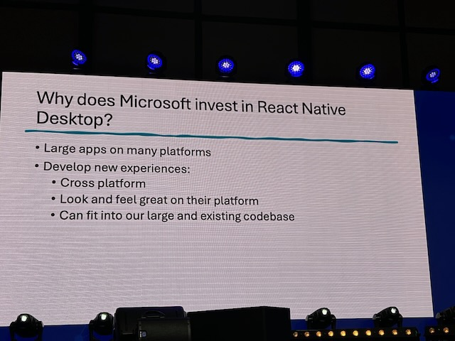

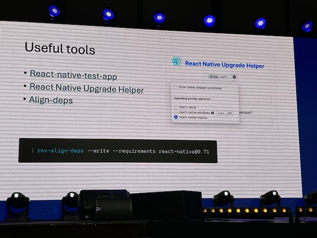

- **_Nate
  Tamagui_**


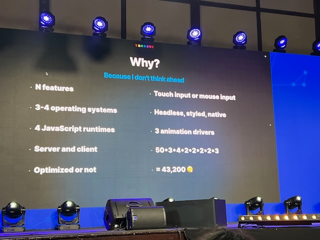


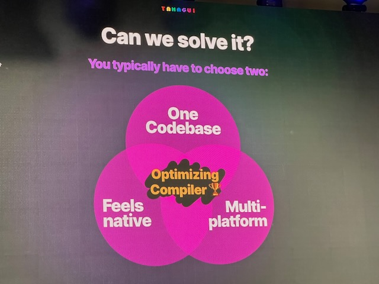
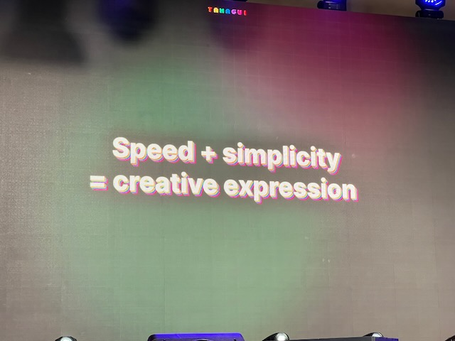

### Evening

[Alchemia](https://www.google.com/maps/place/Alchemia/@50.0522148,19.9450978,3a,75y,90t/data=!3m8!1e2!3m6!1sAF1QipOpEgS-hbJxkLkyERbXAKPiIGmhnWkkeOa0elEe!2e10!3e12!6shttps:%2F%2Flh5.googleusercontent.com%2Fp%2FAF1QipOpEgS-hbJxkLkyERbXAKPiIGmhnWkkeOa0elEe%3Dw99-h86-k-no!7i1334!8i1151!4m16!1m8!3m7!1s0x47165b6a5d7eda4b:0x71c57113b17f155e!2splac+Nowy,+31-056+Kraków,+Polen!3b1!8m2!3d50.0518711!4d19.9446205!16s%2Fg%2F123266t4!3m6!1s0x47165b6c64662dab:0x5daf119c1937989d!8m2!3d50.0521919!4d19.9450021!10e5!16s%2Fg%2F11fmlf4d1n?entry=ttu)


### Friday - talks

- Nicola Corti
  22 - A year in review for React Native


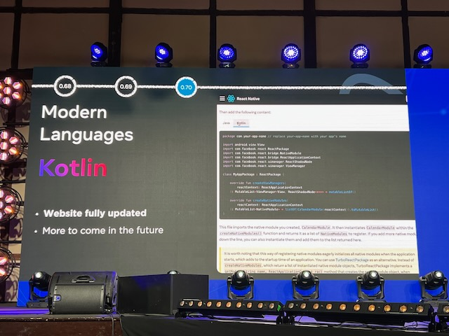


- **_Alex Hunt
  Metro and React Native DevX in 2023_**


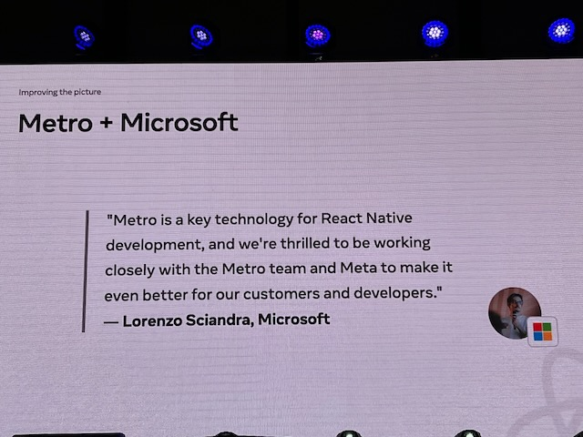

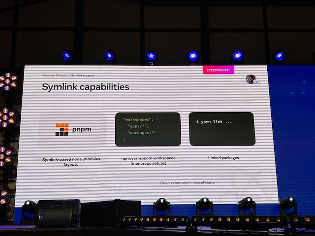
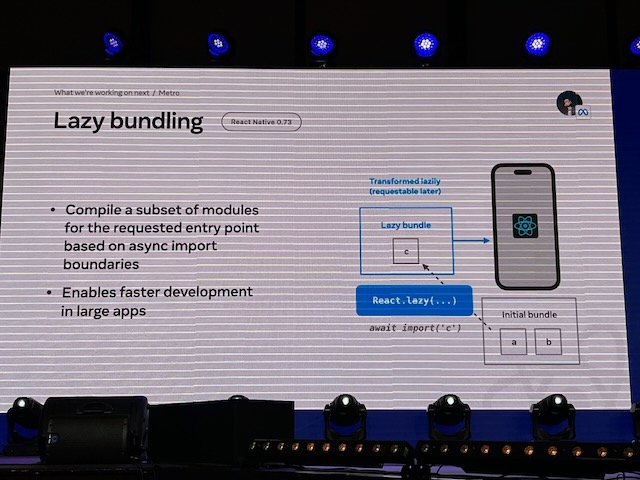


- Vít Horáček
  How Expensify works with the open source community to 'live rich, have fun & save the world'

- **_Cedric van Putten
  Debugging should be easier_**


- Wojciech Stanisz
  The art of React Native: How to make your app stand out
  

- Simon Sturmer
  The long-tail of type safety

  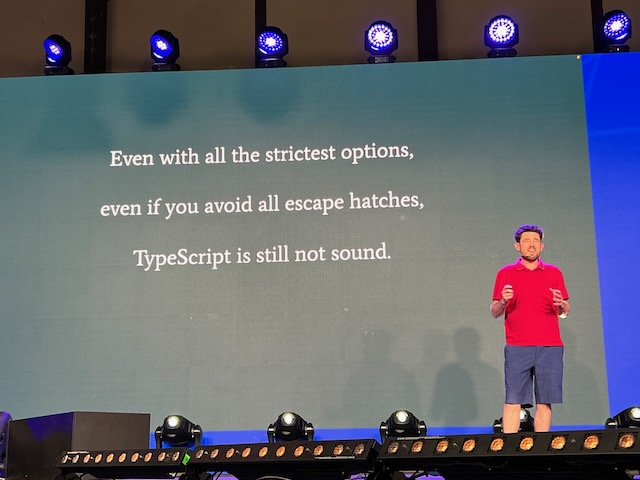
  
  
  
  
  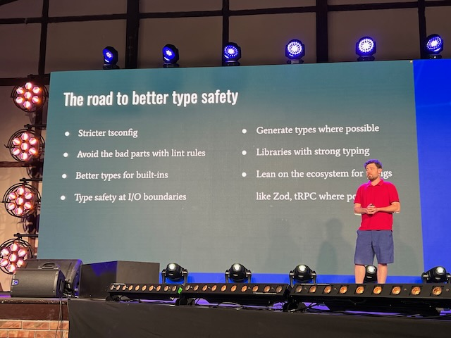

- Ankita Kulkarni
  The performance myths of React Native apps

  
  

- Arthur Lee
  Dark mode at scale with React Native

- **_Varun Dhananjaya, Ashoat Tevosyan
  How to integrate Rust into a React Native app_**

  

- Alexandre Moureaux
  Lighthouse for mobile apps

  
  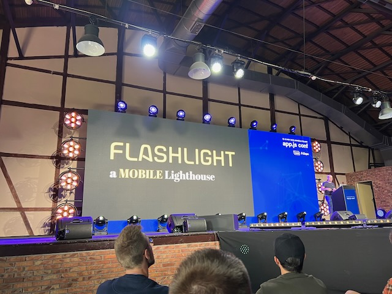
  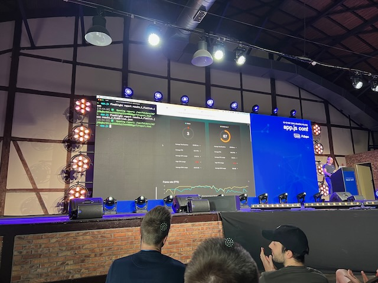

- Henry Moulton
  React Native end-to-end testing with Maestro

  
  
  
  
  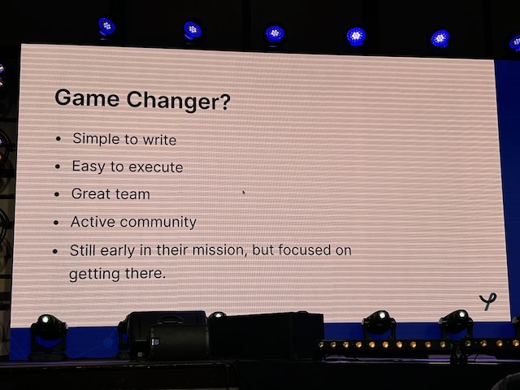

- Jonny Burger
  Making videos in React Native

  

- Panel Discussion

  
